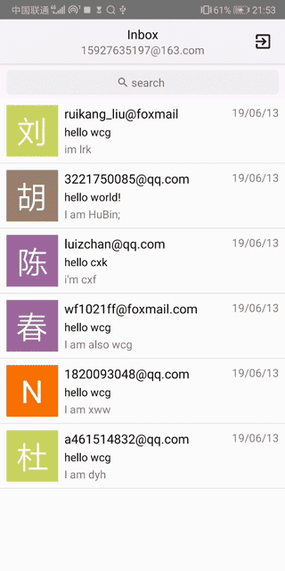
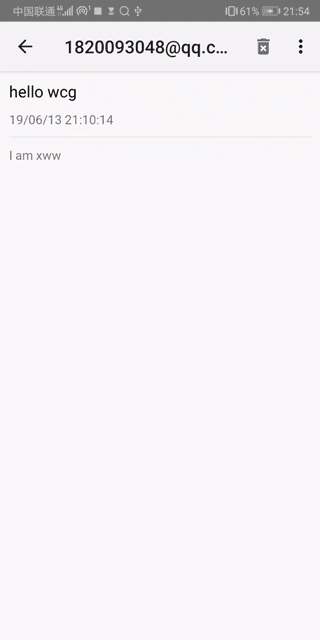
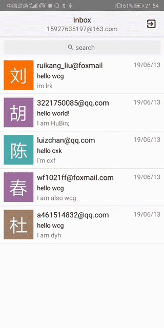

# Romail
Read-only email system, supports pop3 but not smtp.
***
The functions supported:
##### 1. Login check.

##### 2. Look up the email.

##### 3. Delete the email.

##### 4. Logout.

***
The functions in the future:
- SMTP
- Adapt to multiple email format
- The attachment in POP
- Contacts
- Account management
